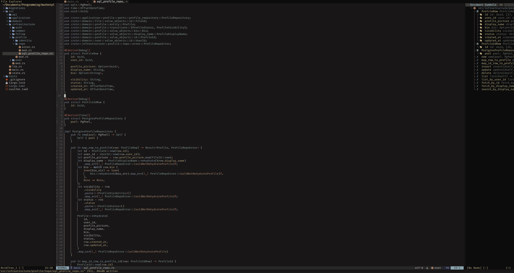
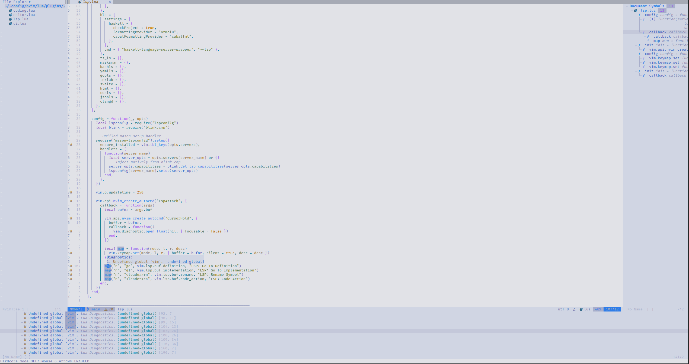
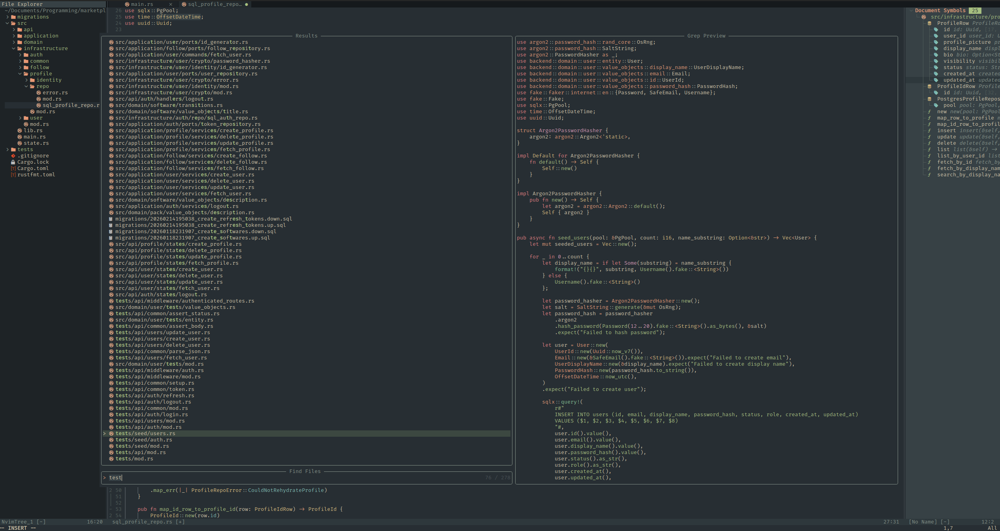

# Custom Keybindings and Autocommands
## General
- `<leader>w`: write buffer.
- `nml`: exit insert mode.
- `<leader>th`: toggle "hardcode" mode (turn on/off mouse and arrow keys).
- `<leader>ta`: toggles just arrow keys on/off.
- `<leader>tm`: toggles just mouse on/off.
- `C-h`: focus left window. 
- `C-j`: focus below window. 
- `C-k`: focus above window. 
- `C-l`: focus right window. 

## Text Editing
- `C-k` (insert mode): view popup with information about current function (args, types, which arg currently typing, etc.).
- `K` (normal mode): view popup for documentation (type definitions, etc.).

## Theme Switching
- `<leader>tt`: open a dialogue for picking a new theme.
- `<leader>tn`: cycle to next theme.
- `<leader>tp`: cycle to previous theme.

## Editor
- (bufferline) `S-h`: previous buffer tab.
- (bufferline) `S-l`: next buffer tab.
- (bufferline) `<leader>bp`: pick a buffer tab.
- (bufferline) `<leader>bc`: close a buffer tab.
- (nvim-tree) `<leader>de`: toggle nvim tree.
- (oil) `<leader>oo` (normal mode): open oil on current working directory.
- (telescope) `<leader>ff`: fuzzy search through files.
- (telescope) `<leader>fg`: live grep over files.
- (todo) `]t`: jump to next TODO comment.
- (todo) `[t`: jump to previous TODO comment.
- (todo) `<leader>xt`: look at TODO comments in Trouble.
- (todo) `<leader>st`: look at TODO comments in Telescope.
- (ufo) `zR`: open all folds.
- (ufo) `zM`: close all folds.
- (ufo) `zp`: preview a fold.

## Coding
- (trouble) `<leader>xx`: check diagnostics.
- (trouble) `<leader>xX`: check diagnostics for current buffer.
- (trouble) `<leader>cs`: look at symbols outline.
- (trouble) `<leader>cl`: list LSP items.
- (trouble) `<leader>xL`: location list of issues.
- (trouble) `<leader>xQ`: quickfix list.
- (lspconfig) `gd` (normal mode): jump to definition.
- (lspconfig) `gI` (normal mode): jump to implementation.
- (lspconfig) `<leader>rn` (normal mode): rename symbol.
- (lspconfig) `<leader>ca` (normal mode): code action.
- (copilot) `<C-S>` (insert mode): ask explicitly for a suggestion, since Copilot is off by default.
- (copilot) `<C-f>` (insert mode): accept line.
- (copilot) `<C-L>` (insert mode): accept word.
- (copilot) `<C-J>`, `<C-]>`, `<C-[`, `<C-X>`: accept suggestion, next suggestion, previous suggestion, dismiss suggestion.
- (vimtex) `<leader>cv` (normal mode): compile Latex.

# Plugins
## Coding
- **blink.cmp**: auto-complete with built-in sources.
- **autopairs**: automatically pair up symbols when typing.
- **surround**: edit characters surrounding pairs.
- **vim-visual-multi**: visualise multiline cursors.
- **friendly-snippets**: some extra snippets, which work alongside blink.

## Editor
- **bufferline**: show a status line with buffers listed like tabs.
- **tree**: adds a panel showing current working directory.
- **oil**: allows for editing of directories.
- **telescope**: fuzzy finding.
- **trouble**: visualising symbols with outlines, and diagnostics.
- **dashboard**: splash screen/dashboard with quick actions when launching Nvim.

## LSP
- **lspconfig**, **mason**: ensure language servers installed.
- **conform**: define formatters for each filetype.
- **copilot**: enable GitHub Copilot integration (off by default).
- **vimtex**: configure automatic Latex compilation and live viewing with Zathura.

## UI
- `<colour schemes>`: self explanatory, managed by a custom handler with custom commands (defined in `lua/config/theme.lua`).
- **lualine**: adds a status line at the bottom with information about current mode, filetype, etc.
- **colorizer**: a colouriser for filling in colours in text.
- **gitsigns**: adds git status and current branch to lualine.
- **indent-blankline**: adds indentation guides.
- **render-markdown**: adds some highlighting for markdown files.
- **todo-comments**: highlights TODO, HACK, FIX, etc. comments.
- **which-key**: quick popup to display what keybindings are available.
- **web-devicons**: adds better icons for filetypes.
- **ufo**: allows for folding and unfolding sets of indented lines (e.g: functions).
